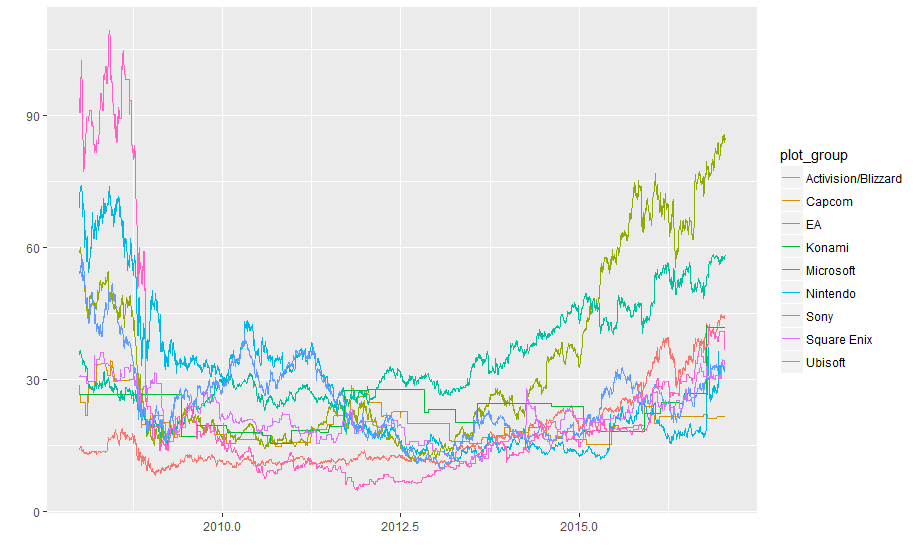
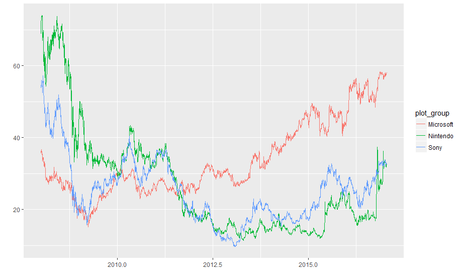

# gaming-stockmarket-r 

Exercice : À l'aide de R, analyser les valeurs à la bourse des 10 dernières années de l'industrie du jeux vidéo à partir des données disponibles sur le site du Nasdaq : http://www.nasdaq.com

## Compagnies :

* Activision/Blizzard
* Capcom
* Electronic Arts
* Konami
* Microsoft
* Nintendo
* Sony
* Square Enix
* Ubisoft

## Conclusions générales

Figure 1. Valeurs boursières de l'Industrie du jeux vidéo 2007-2017

Figure 2. Valeurs boursières des concepteurs de consoles de jeux 2007-2017

* Au début de l'année 2008, Ubisoft est l'entreprise ayant le plus de valeur à la bourse. Cependant, le 14 novembre 2008, il perd la moitié de sa valeur boursière en une seule journée !
* Plus tard, on voit un déclin global de l'industrie.
* Vers 2014, on aperçoit un regain pour l'industrie du jeu vidéo qui se poursuit jusqu'à la fin 2017.
* En 2017, Nintendo a commencé à égaliser les valeurs de Sony. Microsoft demeure au-dessus de ses compétiteurs qui vendent des consoles. (Certainement, grâce à la diversité de ses offres : logiciels, tablettes, jeux vidéo, consoles, etc.).
* Point intéressant : à ce jour, Ubisoft a plus de valeur boursière que Nintendo ou Sony avec une différence d'environ 30$ l'action !
* Finalement, classé en ordre décroissant de valeur boursière en cette fin de 2017, nous obtenons : Electronic Arts, Microsoft, Ubisoft, Activision/Blizzard, Konami, Square Enix, Nintendo, Sony et Capcom. Capcom voit aussi une hausse ces derniers temps.

* Spéculation pour l'avenir : Vu leurs atomes crochus, quand Ubisoft fusionnera-t-il avec ou acquéria-t-il Nintendo afin de tenter de détroner EA ?

# Téléchargement

Vous pouvez téléchargez l'archives .zip du code ou bien utilisez git : $ git clone https://github.com/computer-science-club-ca/gaming-stockmarket-r.git

## Installez R

https://cran.r-project.org/

## Installez R Studio (IDE)

https://www.rstudio.com/products/rstudio/download/#download

# Configuration

Une fois RStudio ouvert et que vous tentez d'Exécuter le script, si la console affiche qu'une librairie est manquante, c'est probablement parce que le "package" n'a pas été installé.
Pour ce faire, il faut ouvrir le menu 'Tools' et sélectionner l'option 'Install packages...'.
Une fenêtre s'affiche, dans la zone de saisie 'Packages', on peut saisir le nom du "package" (librairie) que l'on souhaite, puis confirmer en cliquant sur le bouton 'Install'.

# Notes

La fréquence donnée aux "Time Series" influence grandement l'information affichée, voire la rendre complètement inexacte. Il est impératif de vérifier si les diagrammes composés sont représentatifs des données. Alors avoir une idée de quoi auront l'air les graphiques aide à détecter les erreurs qui peuvent se glisser lors de leur génération.
